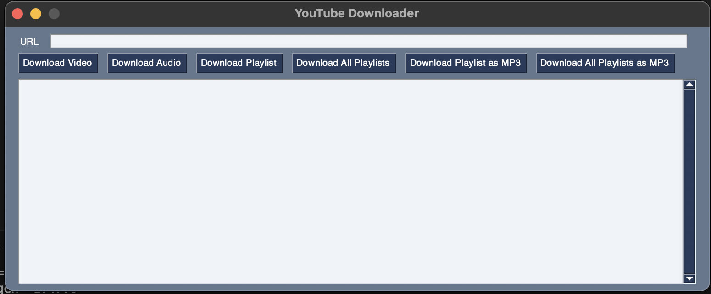

# main.py

This script provides a graphical user interface (GUI) for downloading videos, audio, and playlists from YouTube.

## Prerequisites

Before installing the required Python modules, make sure you have `python-tk` installed on your system as it's necessary for the `tkinter` module. If you're using `brew` on macOS, you can install Python with Tk support using the command `brew install python-tk`. Remember to replace `python-tk` with your Python version in the command.

## Installation

Before running `main.py`, you need to install the required Python modules. These modules are listed in the `requirements.txt` file. You can install all of them by running the following command in your terminal:

```bash
pip install -r requirements.txt
```

## Runing the Script

```bash
python main.py
```

## Modules

- `threading`: This module is used to run downloads in separate threads.
- `PySimpleGUI`: This module is used to create the GUI. It provides a simple and easy-to-use method for creating windows, buttons, text fields, and other GUI elements.
- `yt-dlp`: This is a command-line program to download videos from YouTube and other video sites. It's used in the `YouTubeDownloader` class to handle the actual downloading of content.
- `youtubedownload`: This is a custom module that contains the `YouTubeDownloader` class for downloading content from YouTube.

## Functions

- `main()`: This is the main function that runs the GUI.

## GUI Layout

The GUI consists of the following elements:

- A text field for entering the URL of the video, audio, or playlist to download.
- Buttons for downloading a video, audio, a playlist, all playlists, a playlist as MP3, and all playlists as MP3.
- An output field for displaying the output of the download command.

## YouTubeDownloader

A `YouTubeDownloader` object is created to handle the downloads. The specific methods of this class are not detailed in this script.

## GUI

Here's what the GUI looks like:



## Downloading

When a download button is clicked, the corresponding download method from the `YouTubeDownloader` class is called with the URL from the text field as an argument. The download is run in a separate thread.

## Event Loop

The script enters an event loop where it waits for events from the GUI. If the window is closed, the loop is broken and the script ends.


